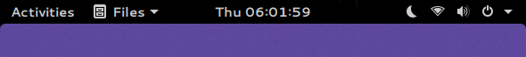
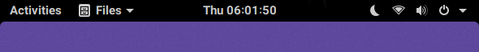

# GNOME Shell Adwaita Roboto Theme
GNOME Shell default theme using Roboto instead of Cantarell.

| Screenshot | GNOME Shell Theme |
|------------|-------------------|
|  | Default Adwaita |
|   | Adwaita Roboto  |

## Installation
1. You need to install [User Themes](https://extensions.gnome.org/extension/19/user-themes/) to load shell themes from the user directory.
2. If you have the User Themes extension installed, you just need to run the following to to intall and enable the theme:
``` bash
./INSTALL
```

## License
GNOME Shell is distributed under the terms of the GNU General Public License,
version 2 or later. See the LICENSE file for details.
